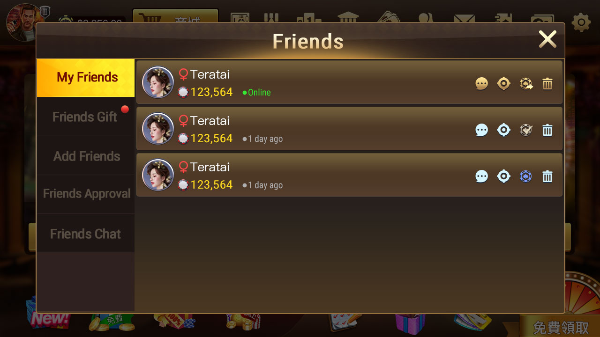
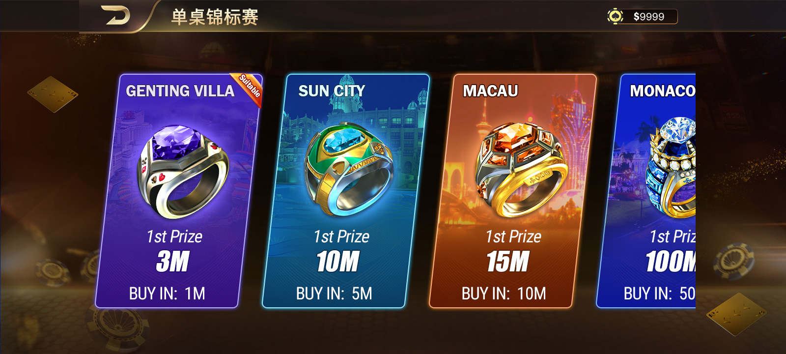
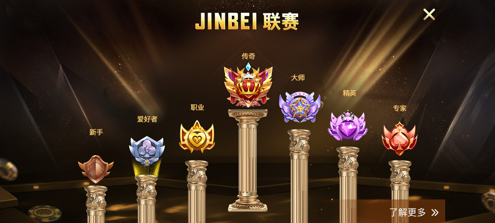
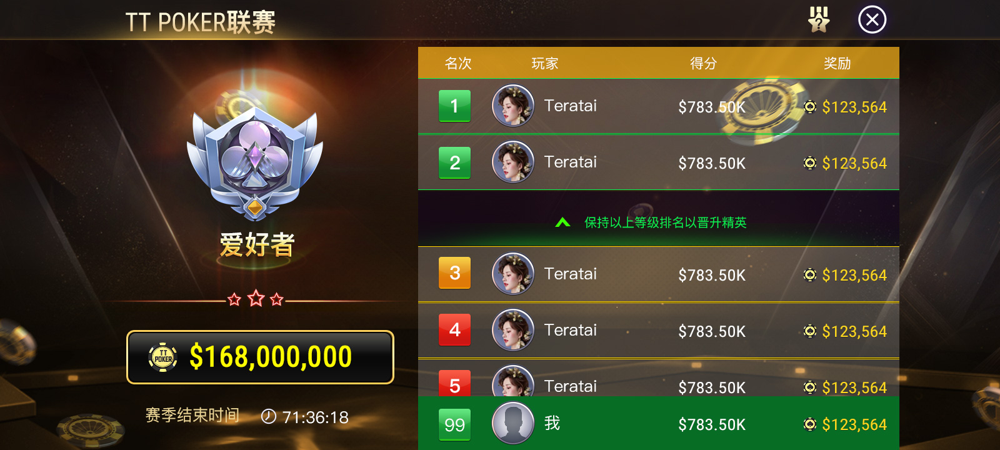
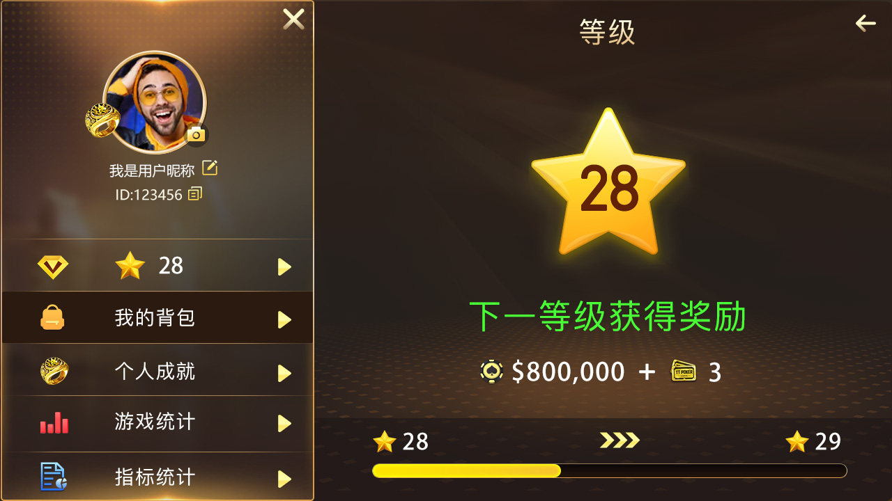
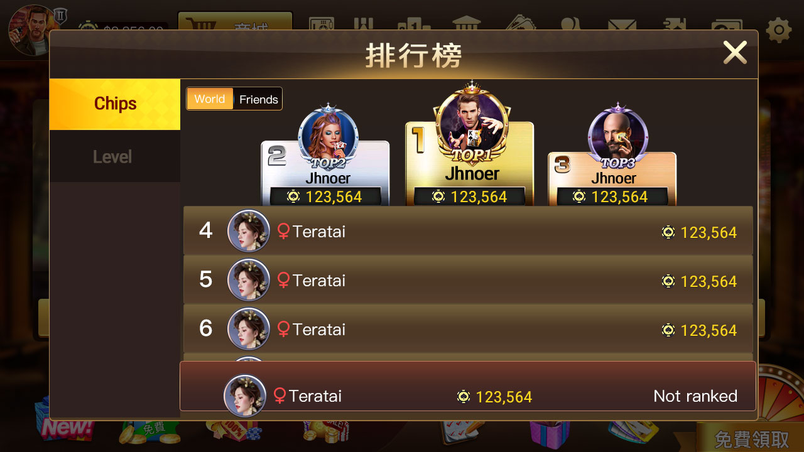
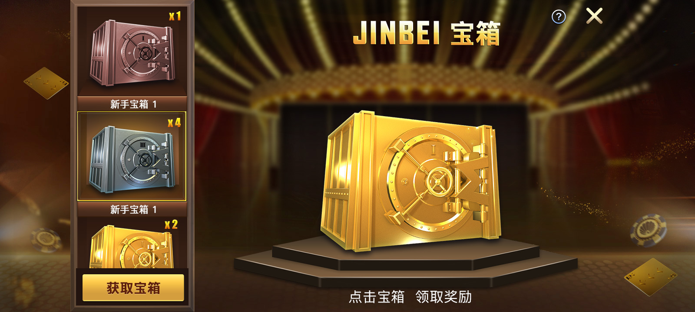
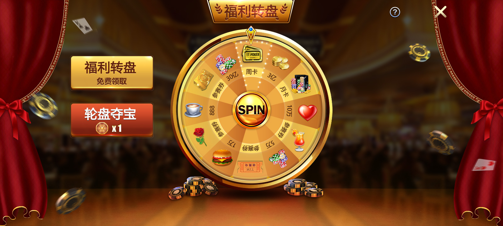

# WPK / HHPoker 風格德州撲克俱樂部源碼

[简体中文](README.md) | [繁體中文](README.zh-TW.md) | [English](README.en.md) | [線上介紹](https://masterai-top.github.io/WPK-HHPoker-Style-Poker-Club-System/zh-tw/)

> 面向德州俱樂部、私人局、好友局、聯賽與 SNG 場景的產品資料與源碼範例。倉庫包含真實產品截圖、Unity 專案資源、C++ 遊戲流程程式碼、Tars 通訊介面及專案設定文件。

[](Packages/manifest.json)
[](gamebegin.cpp)
[](JFGame.tars)
[](https://t.me/xuzongbin001)

## 專案定位

這是一個 WPK / HHPoker 同類俱樂部產品形態的德州撲克專案資料倉庫，重點展示行動端大廳、好友、聯賽、SNG、排行榜、使用者成長與獎勵介面，以及房間與遊戲服務之間的介面設計。本倉庫與 WPK、HHPoker 官方沒有隸屬、授權或相容性承諾。

適合評估德州撲克俱樂部源碼、德州私人局與朋友局產品設計，也可用於理解 Unity 資源管理、C++ 房間遊戲介面及 Tars 服務訊息協定。

## 產品功能

| 模組 | 已展示功能 |
| --- | --- |
| 登入與帳號 | 手機、Email、訪客入口及帳號設定 |
| 遊戲大廳 | 快速遊戲、單桌錦標賽、多桌錦標賽、俱樂部入口 |
| 好友社交 | 好友清單、加入審核、贈禮與聊天入口 |
| 聯賽系統 | 段位成長、聯賽排行和獎勵展示 |
| SNG | 不同報名級別、人數與獎勵資訊 |
| 玩家成長 | 等級、成就、牌局資料與個人資訊 |
| 營運活動 | 排行榜、寶箱、福利轉盤、郵件與獎勵 |

## 玩法流程

1. 玩家從登入頁進入大廳，選擇快速遊戲、SNG、MTT 或俱樂部入口。
2. 好友與私人牌局圍繞邀請、加入、桌內互動及戰績關係建立社交體驗。
3. SNG 按報名條件與獎勵展示賽事選擇；聯賽以段位及排名形成長期目標。
4. 牌桌服務處理玩家訊息、旁觀訊息、房間通訊、開局計時與結算流程。

`Doc/遊戲玩法/` 對應目錄提供 Quick Game、Private 與 SNG 時序圖，可協助理解客戶端、業務服務、房間和遊戲模組之間的呼叫關係。

## 真實產品截圖

| 遊戲大廳 | 好友系統 | SNG 賽事 |
| --- | --- | --- |
|  |  |  |

| 聯賽段位 | 聯賽排行 | 玩家資料 |
| --- | --- | --- |
|  |  |  |

| 排行榜 | 獎勵寶箱 | 福利轉盤 |
| --- | --- | --- |
|  |  |  |

## 技術結構

```text
Unity 客戶端 / 專案資源
        -> Tars 訊息包與大廳路由
        -> Room / Table 介面 <-> C++ 遊戲動態模組
        -> 開局、計時、訊息廣播、旁觀與結算範例
```

- `ITableGame.h` 定義 Game/Table 雙向介面、全桌和旁觀訊息。
- `JFGameCommProto.tars` 定義大廳登入、心跳、聊天、語音、GPS、俱樂部房間和金幣變動訊息。
- `gamebegin.cpp`、`gamecalculate.cpp` 與 timer 檔案展示 C++ 遊戲流程範例。
- `Packages/` 提供 Unity 套件清單；`Doc/` 包含專案設定、熱更新、打包與時序資料。

## 範圍說明

倉庫可直接證明的是上述源碼片段、介面、Unity 套件設定、文件與截圖。完整客戶端資源、資料庫、營運後台、第三方服務及生產環境依賴是否包含，應在取得或部署前逐項核對。本專案頁不把未驗證的 H5、支付、代理後台或完整商用部署能力寫成既定事實。

## 聯絡與展示

- Telegram：[**@xuzongbin001**](https://t.me/xuzongbin001)
- Email：[**masterai918@gmail.com**](mailto:masterai918@gmail.com)

可聯絡了解版本範圍、完整性、展示方式與部署條件。請遵守所在地法規與平台政策。

